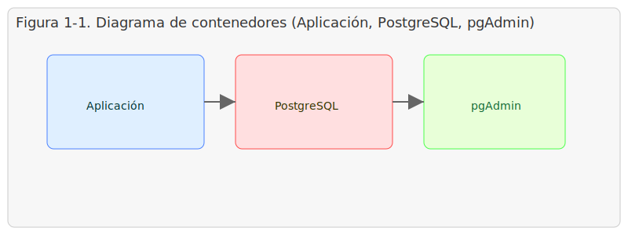
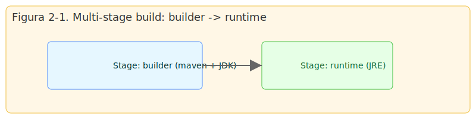
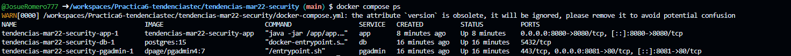
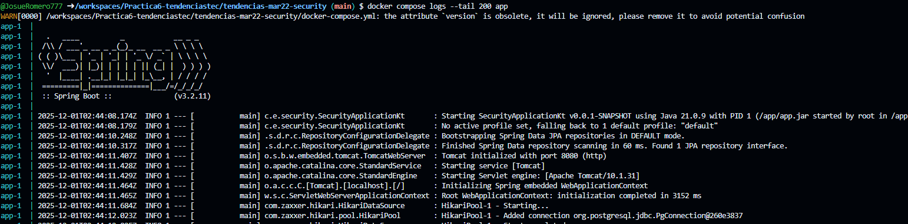
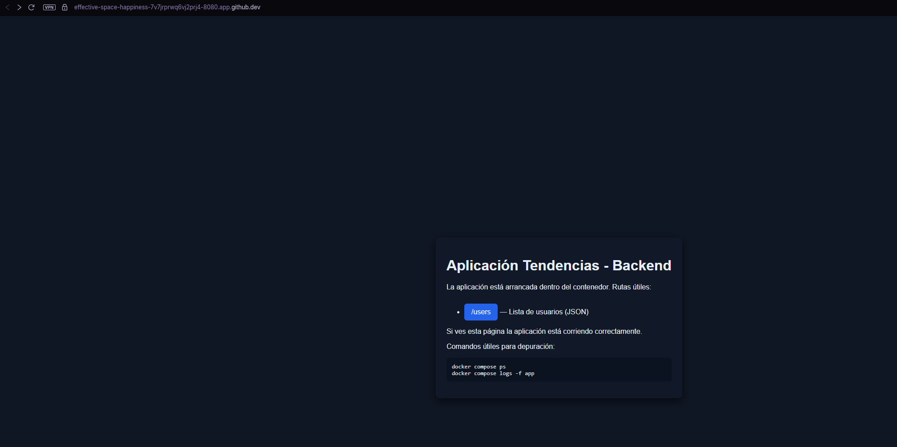
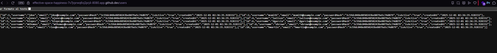
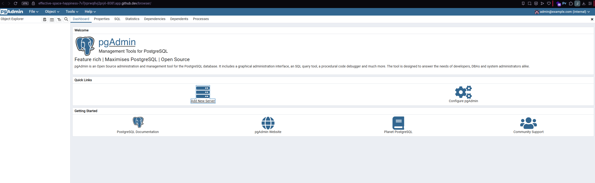
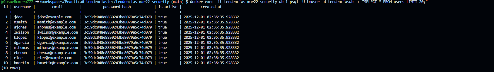

## 1. Título
Automatizar el despliegue de una aplicación backend utilizando Docker y Docker Compose (PostgreSQL + pgAdmin) en entorno local

## 2. Tiempo de duración
45 minutos 

## 3. Fundamentos
Docker permite empaquetar aplicaciones y sus dependencias en contenedores ligeros e independientes del sistema operativo. Docker Compose orquesta múltiples contenedores definiendo servicios, redes y volúmenes en un único archivo `docker-compose.yml`. PostgreSQL es una base de datos relacional que se ejecuta bien en contenedores y requiere persistencia en disco —lograda con volúmenes Docker— para no perder datos entre reinicios. pgAdmin es una interfaz web para administrar PostgreSQL; en un entorno con Docker Compose, pgAdmin se conecta al servicio de PostgreSQL a través de la red definida en Compose.

La técnica de multi-stage builds en Docker permite separar el proceso de construcción (compilar el código) del runtime final. En la primera etapa (builder) se utiliza una imagen con herramientas de compilación (p. ej. Maven + JDK) para generar el artefacto empaquetado (JAR). En la segunda etapa (runtime) se utiliza una imagen más ligera con solo el JRE y se copia únicamente el JAR; esto reduce el tamaño de la imagen final y la superficie de ataque.

Figura 1-1. Diagrama de contenedores:



Además, la separación de entornos (build vs runtime) mejora las buenas prácticas de CI/CD y permite construir imágenes reproducibles y optimizadas.

Figura 2-1. Ejemplo de multi-stage build:



 (Nota: las figuras muestran la relación entre la aplicación, la base de datos y la herramienta de administración.)

## 4. Conocimientos previos
Para realizar esta práctica el estudiante necesita tener claros los siguientes temas:
- Uso básico de la línea de comandos (bash)
- Conocimientos básicos de Git (clonar repositorios)
- Fundamentos de Docker y Docker Compose (construir imágenes, crear contenedores, volúmenes y redes)
- Conceptos de bases de datos relacionales y conexión por JDBC
- Maven 

## 5. Objetivos a alcanzar
- Implementar contenedores para la aplicación backend, PostgreSQL y pgAdmin.
- Asegurar persistencia de datos mediante volúmenes.
- Configurar red para que pgAdmin pueda conectarse a PostgreSQL.
- Crear un Dockerfile multi-stage para optimizar la imagen de la aplicación.
- Documentar el procedimiento y resultados en el `README.md` del proyecto.

## 6. Equipo necesario
- Ordenador con Windows.
- Docker CLI y Docker Compose (v2). Versión mínima recomendada: Docker 24.x; Compose incluido.


## 7. Material de apoyo
- Documentación de Docker: https://docs.docker.com/
- Documentación de Docker Compose: https://docs.docker.com/compose/
- PostgreSQL: https://www.postgresql.org/docs/
- pgAdmin: https://www.pgadmin.org/


## 8. Procedimiento
Paso 1: Clonar el repositorio base.

```bash
git clone https://github.com/maguaman2/tendencias-mar22-security.git
cd tendencias-mar22-security
```

Paso 2: Añadir los archivos de despliegue en la raíz del proyecto:
- `Dockerfile` (multi-stage build)
- `docker-compose.yml` (servicios: db, pgadmin, app)
- `.env` con las variables de entorno
- `.dockerignore`

Paso 3: Construir las imágenes y levantar los servicios:

```bash
docker compose up --build -d
```

Paso 4: Verificar estado de contenedores:

```bash
docker compose ps
```

Paso 5: Acceder a pgAdmin en `http://localhost:8081` e iniciar sesión con las credenciales definidas en `.env`. Crear un servidor en pgAdmin apuntando a: host `db`, puerto `5432`, usuario y contraseña según `.env`.

### Construcción con Docker (multi-stage)

El proyecto incluye un `Dockerfile` multi-stage en la raíz (`tendencias-mar22-security/Dockerfile`). El flujo general es:

- **Stage 1 — builder**: se usa una imagen con Maven y JDK para compilar el proyecto y generar el `*.jar`. Esto permite aprovechar el cache de dependencias y separar la fase de compilación.
- **Stage 2 — runtime**: se usa una imagen más ligera que contiene solo el JRE; desde el `builder` se copia el JAR final y se arranca con `java -jar`.

Ventajas prácticas:
- Reduce el tamaño final de la imagen al excluir herramientas de compilación.
- Mejora la seguridad al minimizar la superficie de ataque de la imagen de producción.
- Facilita reproducibilidad en CI/CD.

Comandos rápidos para construir y comprobar la imagen (ejecutar desde `tendencias-mar22-security`):

```bash
# construir la imagen de la app usando el Dockerfile multi-stage
docker compose build --no-cache app

# levantar los servicios
docker compose up -d

# ver logs de la app
docker compose logs --tail 200 app

# comprobar tamaño de imagen 
docker images --format '{{.Repository}} {{.Tag}} {{.Size}}' | grep tendencias-mar22-security
```


Figura 8-1. Diagrama de pasos 


### Capturas y evidencias 

Por favor guarde las capturas en la carpeta `images/results/` con los nombres exactos indicados abajo. Estas imágenes serán referenciadas en el apartado de resultados del informe.

- **Figura 9-1 — Estado de los contenedores**: archivo `images/results/compose_ps.png`

	

- **Figura 9-2 — Logs de la aplicación**: archivo `images/results/app_logs.png`

	

- **Figura 9-3 — Página raíz de la aplicación**: archivo `images/results/index_page.png`

	

- **Figura 9-4 — Resultado de la API `/users`**: archivo `images/results/users_api.png`

	


- **Figura 9-5 — pgAdmin — interfaz del navegador (volúmenes/tables)**: archivo `images/results/volumes.png`

	- Qué capturar: captura de la interfaz de pgAdmin en el navegador  

	

- **Figura 9-6 — Terminal: salida de la consulta a `users`**: archivo `images/results/volumes2.png` o `images/results/volumes2.txt`


	


## 9. Resultados esperados
Al terminar la práctica se espera:
- Contenedores `db` (PostgreSQL), `pgadmin` y `app` levantados y en estado `healthy`/`running`.
- Persistencia de datos en el volumen `pgdata`.
- Acceso a la interfaz de pgAdmin y conexión correcta al servicio `db`.
- La aplicación backend expuesta en `http://localhost:8080` funcionando y conectándose a la base de datos.

Adicionalmente, debido al uso del Dockerfile multi-stage se espera:

- **Imagen optimizada:** la imagen final de la aplicación debe ser significativamente más pequeña que una imagen que incluya herramientas de compilación (JDK + Maven). El artefacto de ejecución contiene solo el JRE y el JAR de la aplicación.
- **Build reproducible:** la fase de compilación queda aislada en el stage `builder`, facilitando la integración en pipelines CI/CD.
- **Ejecución en runtime ligero:** el contenedor `app` arranca usando `java -jar /app/app.jar` en un JRE limpio; las dependencias de build no quedan en la imagen final.
- **Verificación:** usar `docker images` y `docker compose logs app` para comprobar tamaño de imagen y que Flyway aplicó la migración inicial (tabla `users` creada e insertada).


## 10. Bibliografía
- Docker Docs. Docker, https://docs.docker.com/ (consultado 2025).
- PostgreSQL Global Development Group. PostgreSQL Documentation, https://www.postgresql.org/docs/ (consultado 2025).
- Spring Boot Reference, https://docs.spring.io/spring-boot/docs/current/reference/htmlsingle/ (consultado 2025).

---

Archivos añadidos en este proyecto:

- `Dockerfile` (multi-stage)
- `docker-compose.yml` (PostgreSQL + pgAdmin + App)
- `.env` (variables de entorno)
- `.dockerignore`
- `images/diagrama_containers.svg`, `images/multistage.svg` (diagramas)

Instrucciones rápidas para ejecutar localmente:

```bash
cd tendencias-mar22-security
docker compose up --build -d
# Esperar a que los contenedores estén arriba
docker compose ps
```


